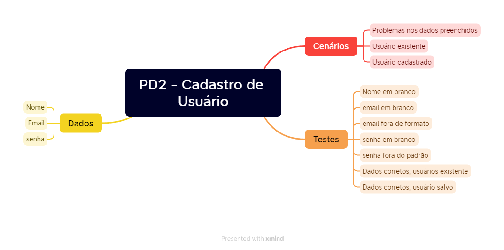

# Projeto XYZ

## Plano de trabalho
### Fluxo
Projeto gerenciado pela equipe, usando listas para cada fase do bug:
* A Fazer
* Em planejamento
* Em execução
* Revisão
* Concluído

Tipos de itens permitidos:
* Bug
* Epic
* User Story
* Task

Fluxo de trabalho

## [User Stories](./User_Stories.pdf)
Disponível no [arquivo pdf](./User_Stories.pdf)

## Mindset

## Casos de testes
Exportados do Zephyr no arquivo [atm-exporter.xlsx](./atm-exporter.xlsx)
